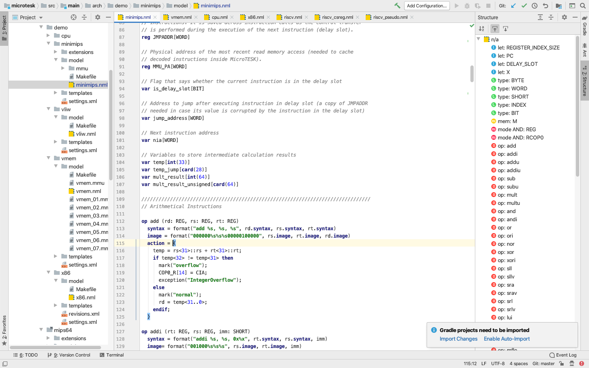

nML Lighter
---

---

__nML Lighter__ is a plugin for IntelliJ IDEA that provides a code editor for the __nML
architecture decription language__.

The plugin is developed by [Dagvanorov Lkhagvajav](https://github.com/tombuuz) as his course work at
[Faculty of Computer Science of Higher School of Economics](https://cs.hse.ru/en/).
The supervisor is [Andrei Tatarnikov](https://github.com/andrewt0301).

__nML-related presentations__

* [Video](https://www.youtube.com/watch?v=7phKiMm3onE)
of the "Machine-Readable Specifications of RISC-V ISA" presentation by Alexander Kamkin 
done at [RISC-V Summit](https://riscv.org/proceedings/2018/12/inaugural-risc-v-summit-proceedings/)
in 2018.

__nML-related publications__

* M. Freericks.
  [The nML Machine Description Formalism](
  http://citeseerx.ist.psu.edu/viewdoc/download?doi=10.1.1.40.4384&rep=rep1&type=pdf).
* M. Freericks et al.
  [Describing Instruction Set Processors Using nML](
  https://core.ac.uk/download/pdf/23797703.pdf).
* A. Kamkin, A. Tatarnikov et al.
  [Specification-Based Test Program Generation for ARM VMSAv8-64 Memory Management Units](
  https://ieeexplore.ieee.org/document/7548929).
* A. Kamkin, A. Tatarnikov et al.
  [MicroTESK: Specification-Based Tool for Constructing Test Program Generators]( 
  https://link.springer.com/chapter/10.1007/978-3-319-70389-3_15).  
* A. Kamkin, A. Tatarnikov et al.
  [Maintaining ISA Specifications in MicroTESK Test Program Generator](
  https://ieeexplore.ieee.org/document/8396942).
* A. Kamkin, A. Tatarnikov et al.
  [Test Program Generator MicroTESK for RISC-V](
  https://ieeexplore.ieee.org/document/8746054).
* A. Kamkin, P. Putro et al.
  [Deductive Binary Code Verification Against Source-Code-Level Specifications](
  https://link.springer.com/chapter/10.1007/978-3-030-50995-8_3).

